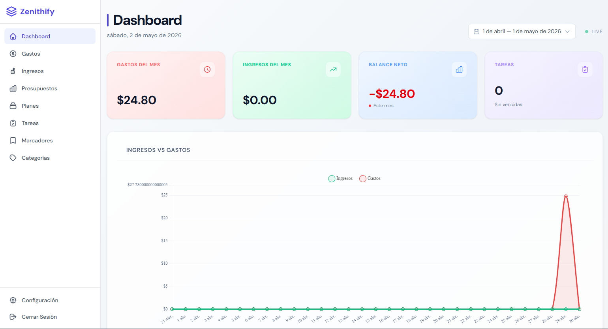
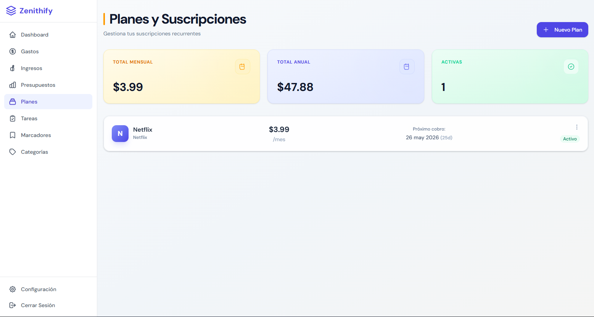
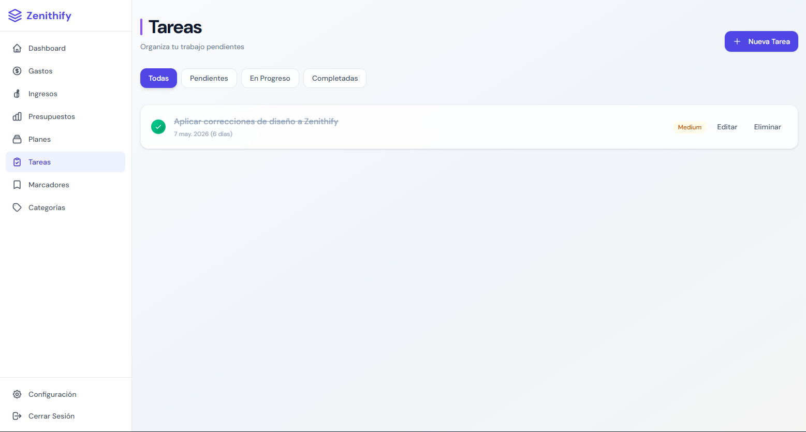
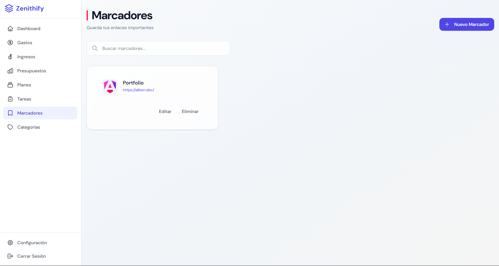
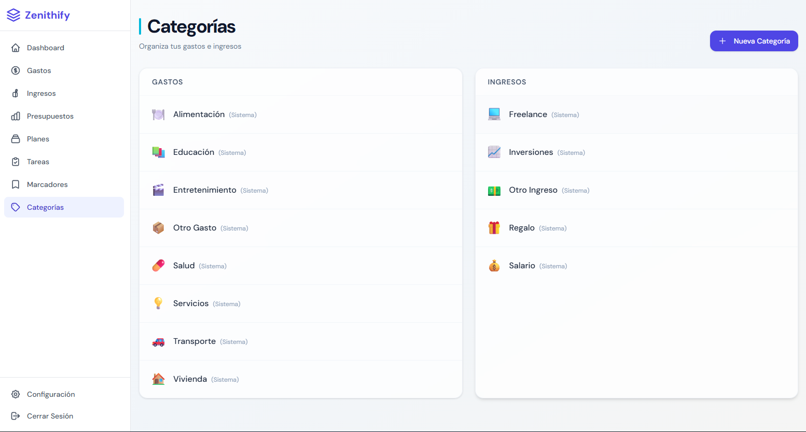

# Zenithify

> Tu centro de control financiero personal


---

Zenithify es una plataforma SaaS personal para gestionar tus finanzas y productividad en un solo lugar. Controla tus gastos e ingresos, establece presupuestos, rastrea suscripciones, organiza tareas y guarda tus enlaces favoritos.

[ Demo](#demo) · [ Inicio Rápido](#inicio-rápido) · [ Funcionalidades](#funcionalidades) · [ Tecnologías](#tecnologías) · [ Arquitectura](#arquitectura)

---

## Demo







---

## Inicio Rápido

### Requisitos Previos

- **Node.js** 18+ y npm 10+
- Una cuenta de [Supabase](https://supabase.com) con un proyecto creado
- PostgreSQL 15+ (provisto por Supabase)

### Configuración del Entorno

1. Clona el repositorio:

```bash
git clone https://github.com/your-username/zenithify.git
cd zenithify
```

2. Instala las dependencias:

```bash
npm install
```

3. Configura las variables de entorno en `src/environments/environment.prod.ts`:

```typescript
export const environment = {
  production: true,
  supabaseUrl: 'YOUR_SUPABASE_URL',
  supabaseAnonKey: 'YOUR_SUPABASE_ANON_KEY',
  dolarApiUrl: 'https://ve.dolarapi.com/v1/dolares',
};
```

4. Ejecuta el schema de base de datos en tu proyecto de Supabase:

```bash
npx supabase db push
```

O copia manualmente el contenido de `supabase/schema.sql` en el SQL Editor de Supabase.

5. Inicia el servidor de desarrollo:

```bash
ng serve
```

La aplicación estará disponible en `http://localhost:4200`

### Compilar para Producción

```bash
ng build
```

Los archivos compilados estarán en `dist/zenithify/browser/`

---

## Funcionalidades

### Gestión Financiera

| Funcionalidad         | Descripción                                                            |
| --------------------- | ---------------------------------------------------------------------- |
| **Gastos e Ingresos** | Registra transacciones en USD y VES con tasas de cambio personalizadas |
| **Presupuestos**      | Establece límites semanales, mensuales o anuales por categoría         |
| **Suscripciones**     | Controla fechas de renovación y costos recurrentes                     |
| **Tasas de Cambio**   | Obtención automática del tipo de cambio oficial VES/USD                |

### Productividad

| Funcionalidad  | Descripción                                                    |
| -------------- | -------------------------------------------------------------- |
| **Tareas**     | Tablero Kanban con prioridades y fechas de vencimiento         |
| **Marcadores** | Guarda URLs con favicons automáticos y etiquetas               |
| **Categorías** | Sistema de categorías predefinidas + categorías personalizadas |

### Multi-Moneda

- Registro de transacciones en **USD** y **VES**
- Tasas de cambio configurables por usuario
- Resumen financiero en ambas monedas

---

## Tecnologías

| Categoría       | Tecnología                                    |
| --------------- | --------------------------------------------- |
| **Framework**   | Angular 21 (standalone components, signals)   |
| **Lenguaje**    | TypeScript (strict mode)                      |
| **Estilos**     | TailwindCSS 4                                 |
| **Backend**     | Supabase (PostgreSQL + Auth + Edge Functions) |
| **Gráficos**    | Chart.js 4.5.1                                |
| **Testing**     | Vitest                                        |
| **API Externa** | DolarAPI (tasas de cambio VES)                |

### Autenticación

- Email/Contraseña
- Google OAuth

---

## Arquitectura

Zenithify sigue una **Arquitectura Hexagonal** (Ports & Adapters):

```
src/app/
├── core/
│   ├── domain/           # Entidades de negocio, value objects, servicios
│   ├── application/       # Casos de uso, puertos (interfaces), DTOs
│   └── infrastructure/    # Adaptadores (implementaciones Supabase)
├── shared/               # Componentes UI, utils, guards, interceptors
└── features/             # Módulos lazy-loaded
    ├── dashboard/
    ├── expenses/
    ├── incomes/
    ├── budgets/
    ├── plans/
    ├── tasks/
    ├── bookmarks/
    ├── categories/
    ├── settings/
    └── auth/
```

### Seguridad

- **Row Level Security (RLS)** en todas las tablas de PostgreSQL
- Multi-tenancy implementada a nivel de base de datos
- Auth guards para rutas protegidas
- Interceptors para validación de sesiones

---

## Licencia

MIT License - ver [LICENSE](LICENSE) para más detalles.
